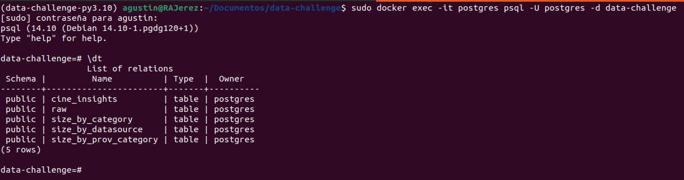
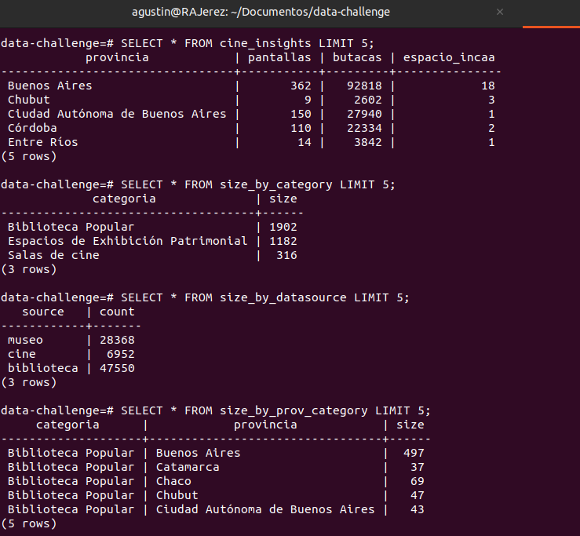

# Data Challenge
He realizado la resolucion de un reto de Alkemy en el que se debe crear un proyecto que consuma datos desde
3 fuentes distintas para popular una base de datos SQL con información cultural
sobre bibliotecas, museos y salas de cines argentinos.

## Extracción:
- Se realiza la extracción de los datos y se organizan en rutas siguiendo la siguiente estructura: “categoría\año-mes\categoria-dia-mes-año.csv”.

## Procesamiento de datos:
- Se normaliza toda la información de Museos, Salas de Cine y Bibliotecas
Populares, para crear una única tabla que contenga:
    - cod_localidad
    - id_provincia
    - id_departamento
    - categoría
    - provincia
    - localidad
    - nombre
    - domicilio
    - código postal
    - número de teléfono
    - mail
    - web

- Se procesa los datos conjuntos para poder generar una tabla con la siguiente
información:
    - Cantidad de registros totales por categoría
    - Cantidad de registros totales por fuente
    - Cantidad de registros por provincia y categoría

- Se procesa la información de cines para poder crear una tabla que contenga:
    - Provincia
    - Cantidad de pantallas
    - Cantidad de butacas
    - Cantidad de espacios INCAA

## Herramientas utilizadas:
- Python==3.10
- Poetry==1.7.1
- Postgres==14
- Docker24.0.7

## Librerias Utilizadas
- pandas==2.1.4
- sqlalchemy==2.0.25
- psycopg2-binary==2.9.9
- click==8.1.7
- python-decouple==3.8
- requests==2.31.0
- ipykernel==6.28.0

## Prerequisitos para poder correr el proyecto
#### Poetry
Utilizé Poetry para un mejor manejo de dependecias y también para crear mi entorno virtual.

Instalar poetry desde pipx y la instalación se realizara aislada del entorno global
    
    pipx install poetry

Para instalar las dependencias necesarias descriptas en pyproyect.toml

    poetry install

Automaticamente se creara un entorno virtual al cual puede acceder

    poetry shell

#### Opción sin Poetry
En caso de no usar poetry puede instalar las dependencias a traves de requirements.txt
El proyecto se realizó con Python 3.10

    python3 -m virtualenv venv

    source venv/bin/activate

    pip install -r 'requirements.txt'

## Data Research
Se realiza un pre-análisis del datasource para saber como se encuentran conformados los datos y el tipo de transformaciones que se deberia realizar.
Puede verlo en el archivo de jupyter-notebook 'data_exploratory.ipynb'

## Creación de base de datos, tablas y ejecución de pipeline
Levanto contenedor con Base de datos Postgres:

    sudo docker compose up -d

Puede acceder a la base de datos desde bash:

    docker exec -it postgres psql -U postgres -d data-challenge

Crear de tablas en base de datos
El siguiente script realiza la conexión con la base de datos y ejecuta los script.sql almacenados en la carpeta data-challenge/sql.

    python3 script.py

En la siguiente imagen se puede visualizar la creacion de las tablas necesarias:

Ejecutar pipeline:

    python data-challenge/main.py --date YYYY-MM-DD

En la siguiente imagen se realizan consultas en la base de datos verificando que la transformacion y la carga se haya realizado correctamente:

